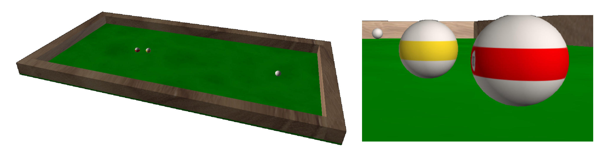
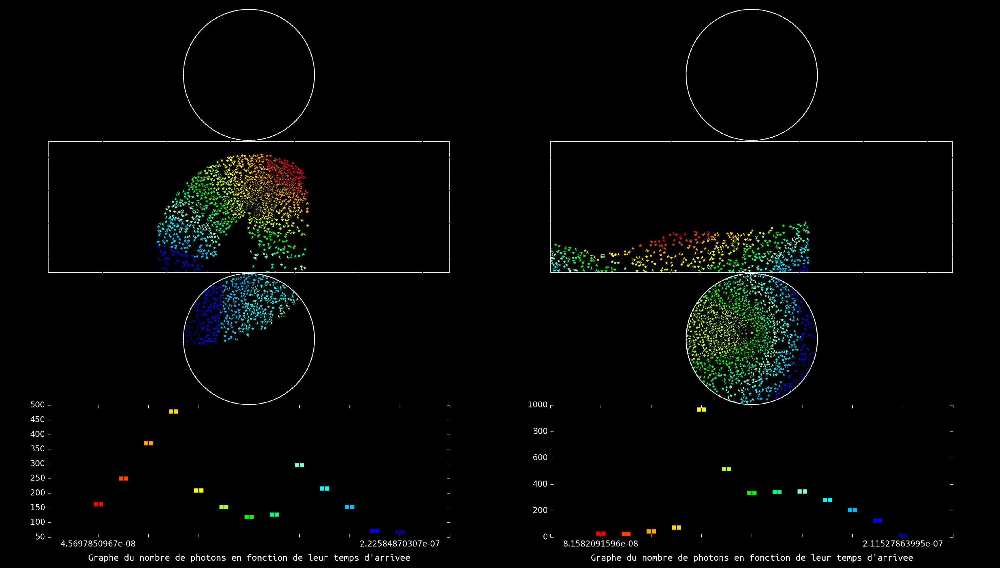

 
Here's a quick glance at a few of my python projects:

<dl>
    <dt><b>Realistic simulation of a billiard game</b> (Report: , Slides )</dt>
    <dd>Programming project realised during second python course at university. A physically realistic simulation of a billiard game was attemped based on the works of Leckie and Greenspan (<a href="https://doi.org/10.1007/11922155_19">ref.</a>). Based on the parametrisation of the balls trajectory which enables analytical determination of the instants at which balls
      collide or change state as solutions of polynomials equations. We study the movement of the ball after impact, taking into account rotation
      of the ball and investigating some simple two-ball shots with effects (<em>follow</em> and <em>draw</em>).
      <figure class="align-center">
  
        <figcaption><b>Billiard simulation.</b> The general look-and-feel of the simulation was coded in VPython whereas the physics was simulated in python.</figcaption>
</figure>
      </dd>
  
  <dt><b>Simulation of the detection of muons in a Cherenkov detector</b> (Slides )</dt>
    <dd>Programming project realised during the first python course at university. A Cherenkov detector is usually a huge reservoir of heavy water with its inner surface lined with photodetectors. When a neutrino goes through the medium it can decay into a muon which emits photons. Thus depending on the angle of incidence of the neutrino, the velocity of the muon, several patterns can emerge. This project simulates the patterns that can be obtained in such an experiment and has the advantage to produce real nice images.
<figure class="align-center">
  
  <figcaption><b>Event detection in a Cherenkov detector.</b></figcaption>
</figure>
  </dd>
</dl>
